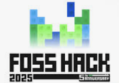

# CasePilot

## Created During : 
<table>
    <tr>
      <th>Event Logo</th>
      <th>Event Name</th>
      <th>Event Description</th>
    </tr>
    <tr>
        <td></td>
        <td>FossHack 2025</td>
        <td>FOSS Hack 2025 is the fifth edition of FOSS Hack, a hybrid hackathon to promote Free and Open Source Software by bringing together students and professionals to build or extend FOSS projects.
    </tr>
</table>

## Introduction

- [Introduction](#-Introduction)
- [Demo Video](#-Demo-Video)
- [Features](#-Features)
- [Future Plans](#-Future-Plans)
- [Installation](#-Installation)
- [How to Contribute?](#-How-to-Contribute)
- [Tech Stack](#-Tech-Stack)
- [Datasets Used](#-Datasets)

## 📝 Introduction

Accessing affordable and specialized legal assistance is a significant challenge for both clients and lawyers. Clients often struggle to find legal professionals who align with their specific needs and budgets. On the other hand, lawyers—particularly those new to the profession—face difficulties in reaching potential clients and showcasing their expertise. The lack of a dedicated, accessible platform creates barriers for both parties, making it harder for clients to receive timely legal help and for lawyers to grow their practice. Additionally, navigating legal systems can be complex, requiring access to past case precedents, legal documents, and accurate legal advice.

CasePilot addresses this gap by providing a comprehensive platform that connects clients with lawyers based on expertise, case history, and fee range—ensuring that those in need of legal help can find the right professionals quickly and affordably. Beyond client-lawyer matching, CasePilot offers powerful tools like a Precedent Finder using cosine similarity to retrieve similar past cases, an AI-powered legal chatbot for instant responses to legal queries, and automated legal notice generation through customizable templates.

By combining these features, CasePilot not only facilitates better client-lawyer connections but also simplifies legal processes, making legal assistance more accessible and efficient for everyone.

## 🎥 Demo Video


## 📸 Screenshots

## ⭐ Features

* **Lawyer-Client Matching:**
    * Connects clients with suitable lawyers based on:
        * Area of expertise
        * Fee structures
        * Past experience
        * User reviews
    * **Client Functionality:**
        * Post cases on a public forum for lawyer responses.
        * Browse a lawyer database and directly request referrals and case assistance.
    * **Lawyer Functionality:**
        * Browse available cases in the public forums.
        * Accept or reject direct case requests from clients.

* **Precedent Finder:**
    * Utilizes cosine similarity to identify and present relevant legal precedents based on a given case description.
    * Trained on a comprehensive database of top cases across various legal areas and years.
    * Empowers lawyers to build well-rounded arguments informed by past rulings.

* **Legal Chatbot:**
    * Provides instant responses to legal queries through an AI-powered chatbot.
    * Fine-tuned on a vast legal Q&A dataset.
    * Offers quick answers to common legal questions.
    * Directs users to relevant resources for in-depth information.
    * Useful for both clients and advocates.

* **Automated Legal Notice Generation:**
    * Generates professional legal notices from customizable templates.
    * Simplifies the process with user-friendly input fields.

* **Lawyer Dashboard:**
    * Provides a centralized hub for case management.
    * Displays:
        * Case details
        * Case histories
        * Important dates
        * Relevant documents
        * Client interactions
    * Integrates with calendar support for seamless scheduling.
    * Provides a clutter free workspace for efficient case management.


## 🚀 Future Plans

- **AI Case Summarization:** Implementing AI-driven case summaries to provide concise overviews of complex cases.
- **Multi-Language Support:** Enabling the platform to work across multiple languages for broader accessibility.
- **Section finding form text:** Automating the identification of legal sections relevant to a case description.

## ⚙️ Installation

1. Clone the Repository

```bash
git clone https://github.com/FOSS-Hack/CasePilot.git
```

2. Install Dependencies

```bash
cd CasePilot
npm install
```

3. Set Up Environment Variables

Create a `.env` file in the root directory and add your Supabase and other required credentials.

4. Run the Application

```bash
npm run dev
```

## 🤝 How to Contribute?

CasePilot is an open-source project, and we welcome contributions from the community! Follow these steps to get started:

1. **Fork the Repository:** Click "Fork" on GitHub to copy the repository to your account.
2. **Clone Your Fork:**

```bash
git clone https://github.com/your-username/CasePilot.git
```

3. **Create a Branch:**

```bash
git checkout -b feature-or-bugfix-name
```

4. **Make Changes & Commit:**

```bash
git commit -m "Add your change description"
```

5. **Push to Your Fork:**

```bash
git push origin feature-or-bugfix-name
```

6. **Submit a Pull Request:** Open a pull request and provide a detailed explanation of your changes.

If you encounter any issues, feel free to open a ticket in the [Issues](https://github.com/FOSS-Hack/CasePilot/issues) section.

## 💻 Tech Stack

- **Next.js:** Framework for the frontend and server-side rendering.
- **Supabase:** Open-source backend for authentication and database management.
- **Python:** For advanced AI models like precedent finding using cosine similarity and chatbot functionalities.

## 📊 Datasets

LLM Fine-Tuning Dataset of Indian Legal Texts - https://www.kaggle.com/datasets/akshatgupta7/llm-fine-tuning-dataset-of-indian-legal-texts

Supreme Court of India - 2025 Volumes 1 & 2 - https://digiscr.sci.gov.in/

Thank you for being a part of CasePilot! Your contributions and support make a difference. 🚀


